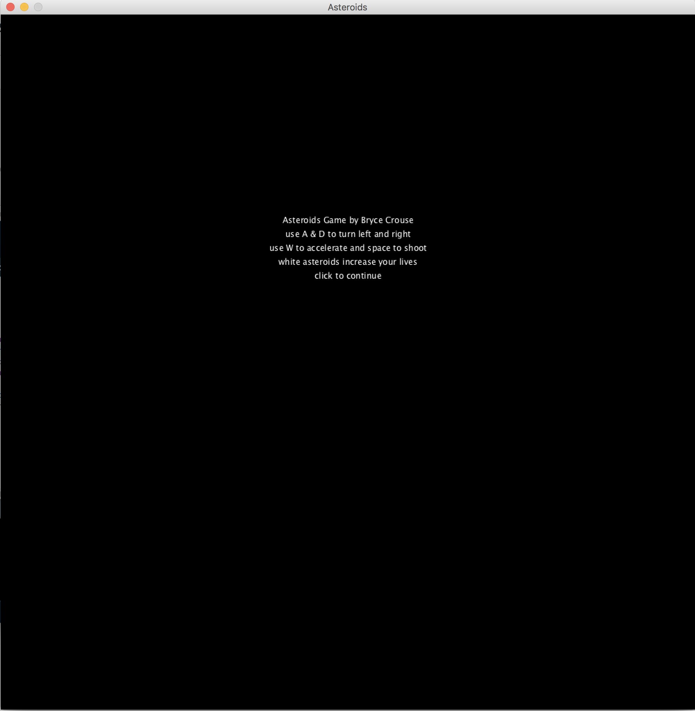
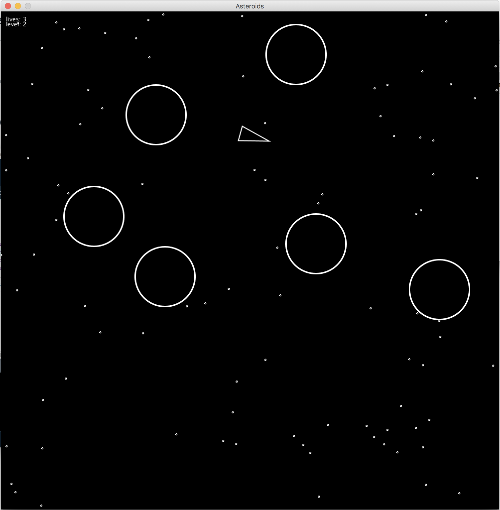
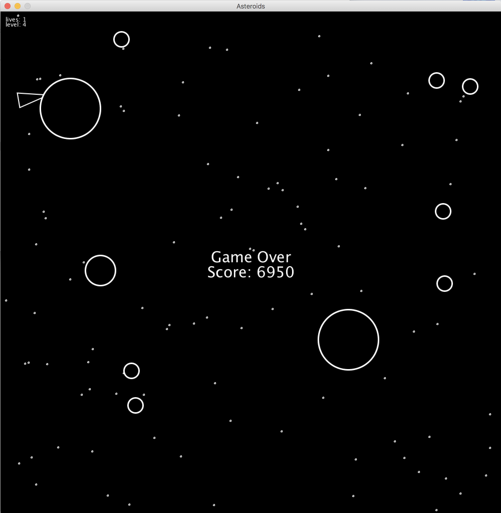
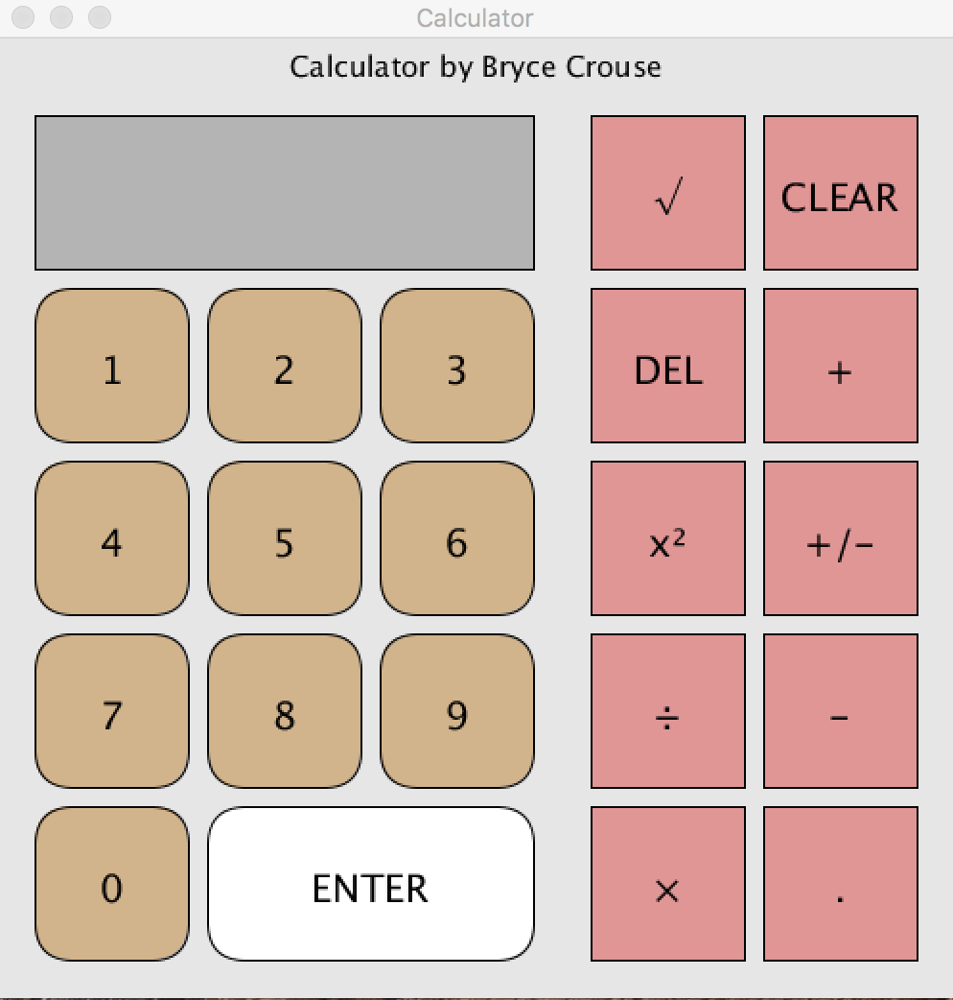
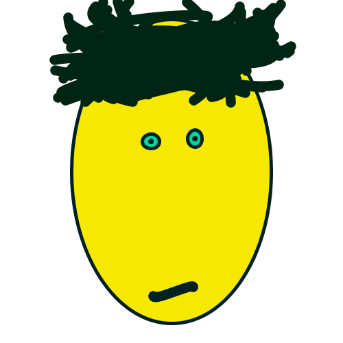
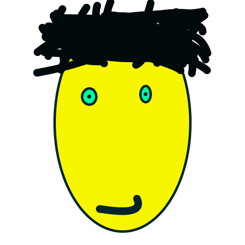

Bryce Crouse's Programming 1 Portfolio(2018-2019).
Contact me at brycecrouse@gmail.com.

First Semester Asteroids Clone:

[Source code for Asteroids](https://github.com/maadscientist/Programming1Portfolio/tree/master/Asteroids/Asteroids)
(May need to enable processing sound library for it to function correctly)

First Semester Processing Java Calculator (Completed Nov. 2018):

[Source code for calculator](https://github.com/maadscientist/Programming1Portfolio/tree/master/Calculator)

Etch-a-sketch w/ 360 degree movement:
An etch-a-sketch project that I modified so you can have 360 degree motion. You can modify the source code to get it to draw cool shapes. Works kind of like the editor in Terrapin Logo.

[Source code](https://github.com/maadscientist/Programming1Portfolio/blob/master/EtchASketch/Etchasketch.pde)

Random Face Generator
Randomly generates a face every few seconds. You can click to save the face as a png.

[Source code](https://github.com/maadscientist/Programming1Portfolio/blob/master/FaceGenerator)

Igpay Atinlay converter
Converts some text you input into pig latin. Written in python. 
[Source code](https://github.com/maadscientist/Programming1Portfolio/blob/master/pigLatin.py)
